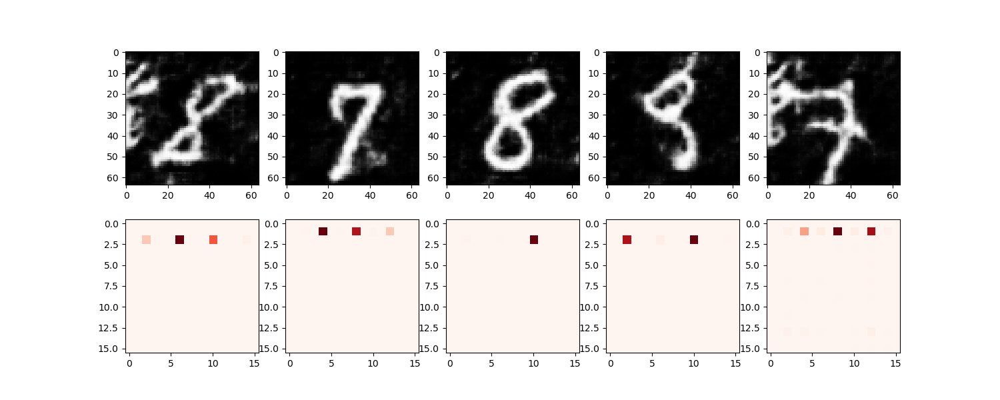

# PyTorch-SAGAN
An implementation of Self-Attention GAN in PyTorch.

Self-Attention GANの特徴的な構成要素として、以下がある。

- Self-Attention
- Pointwise Convolution
- Spectral Normalization

## Self-Attention
- DCGANなどでは、転置畳み込みを用い画像を生成していた
- これは「局所的な情報」を拡大するだけという問題がある
- 大域的な情報を考慮しつつ、拡大できるしくみがほしい
- 気持ちとしては、DCGANにおける各レイヤーの出力に、大域的な情報を考慮した特徴量を加えたい
  - そこで、大域的な情報を考慮した特徴量を作るためにSelf-Attentionを導入
  - じゃあ大域的な情報って何かというと、自分と特徴量が似ているセルの情報を取ってくるということ

Transformerとかでも用いられているかなり一般的な手法。

## Pointwise Convolution
- カーネルサイズが1×1の畳み込み層
- つまり適用することで、チャネル数が変化する（サイズはそのまま）
- 次元圧縮のような役割を果たしている。

## Spectral Normalization
- 畳み込み層などのモジュール重みパラメータに対する正規化手法
- Discriminatorにリプシッツ連続性を持たせるためにSpectral Normalizationを導入している
- 感覚として、「ロバスト性を保つ」ために、「最大固有値を用いた正規化」を行っている

## PyTorch・SAGANの実装上の注意などメモ
- `torch.bmm`はミニバッチごとに行列積を行う。
  - つまり、(batch, n, m)と(batch, m, p)にこれを適用すると(batch, n, p)になる
- 損失関数に敵対的ヒンジ損失を用いている
  - Discriminatorの損失関数
    - \[ -\frac{1}{M}\sum_{i=1}^M [l_i * \min(0, -1 + y_i) + (1 - l_i) * min(0, -1 - y_i)] \]
  - generatorの損失関数
    - \[ -\frac{1}{M}\sum_{i=1}^M D(G(z_i)) \]
  - 経験的にうまく学習できるからこれを用いているっぽい（謎）

## 結果
7と8の画像を用い生成を行った。モード崩壊は生じていないが、あまりうまく生成できていない……

 
